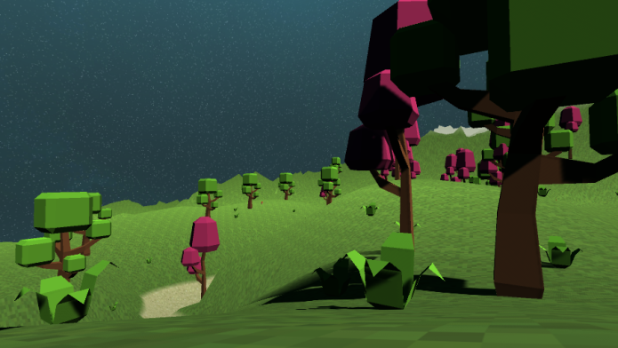
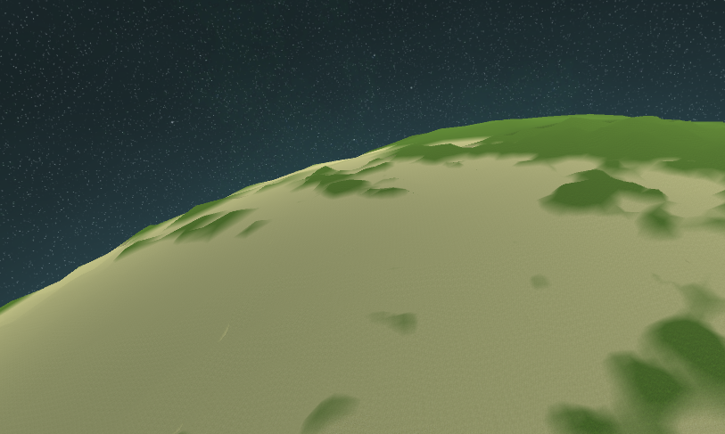

# Spaceworks #

Spaceworks is work-in-progress c# library designed to be an "all-in-one" library for the Unity3D Game Engine to aid people in overcoming many of the inherent difficulties with making space based games. This library including many different systems which all of which help programmers manage and design new systems. Some of these systems include: a planetary body renderer, keplerian orbit system, floating origin manager, multi-threading, resource pooling and more. The ```/docs``` folder contains a code of conduct document, contribution guidelines document, issue template, and pull request template. 

## Motivation ##

I have always loved space, and by extension space themed games. Space can create many interesting challenges to game designers and programmers that can make them very difficult to complete. I have noticed that while many of these issues are addressed in academic articles and discussions, there are very few publicly available libraries which implement the techniques. 

## How To Install ##

Simply download the source code from this GIT repository and import it anywhere in the Assets folder of an existing Unity3D project.

## Project Structure ##

1. docs
	* Github related documentation
2. Materials
	* Pre-configured test materials
3. Primitives
	* C# classes that are utilized by each of the systems within Spaceworks
	1. Components
		* MonoBehaviour based components to aid in testing systems
	2. Data Structures
		* Pure data structures that are used to store or encapsulate other information or ideas.
		1. Math
		2. Meshes
		3. Noise
		4. Octree
		5. Quadtree
		6. Stores
4. Scenes
	* Unity3d scenes designed to test specific systems of Spaceworks
5. Screenshots
	* Screenshots used for demonstrations
6. Shaders
	* Pre-made shaders related to rendering specific objects in space.
5. Systems
	* C# scripts relating to various parts of Spaceworks
	1. Floating Origin
		* Move objects in the scene to keep "nearby" objects close to the scene origin and therefor in the highest level of floating point precision.
	2. Modular Construction
		* Use modular parts and allow them to "clip" together in well defined ways. 
	3. Orbits
		* Describe motion of planetary bodies in space. 
	4. Planet Name Generator
		* Pseudo-randomly generate names for planets, creatures, or more.
	5. Planet Renderer
		* Create and render planetary geometry using a quad-tree to store levels of detail
	6. Pooling
		* Save resources by reusing objects for later.
	7. Radar3d
		* 3d radar implementation
	8. Solar System
		* Create full sized solar systems by creating a small "model" that is easy to modify. 
	9. Threading
		* Classes for creating async tasks and resolve them using a pool of threads.

## Screenshots ##


